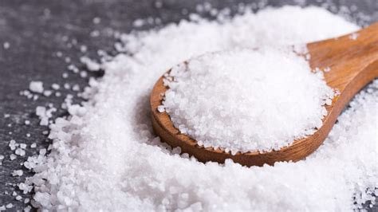

Keeping a good and balanced diet is fundamental to having a healthy life as it helps avoiding food-related illnesses such as diabetes, obesity and cardiovascular diseases. However, the price of the food products influences greatly the decisions of individuals in purchasing them or not. There is a strong belief amongst consumers that more expensive products are healthier than cheaper ones, even this is not always true. Thus, we ask ourselves: do people have an equal chance in maintaining a nutritious diet and thus a healthy life?

### What is the average diet of a Londoner?



### What constitutes a healthy diet?

  

      

          

              

                  <h2>Salt</h2>
              

          

          
 <!-- back content -->
              <blockquote>
                  
2019 portrait:
 
   Single  Male  Good  American   Criminal   College  1m80   86kg   Blue eyes   Black hair
              </blockquote>
              

                  

                      
                  

                  
Salt

              

          

      

  
 <!-- .flip-container -->

<iframe frameborder="1" class="juxtapose" width="350" height="400" marginwidth="500" align="middle" src="https://cdn.knightlab.com/libs/juxtapose/latest/embed/index.html?uid=539588b2-3f8c-11eb-83c8-ebb5d6f907df"></iframe>

### What is the proportion of food related expenditure in each borough? How does it relate to its economic situation?

### How does a healthy diet relates to the borough's economic situation? Is this connection area-dependent?


  

